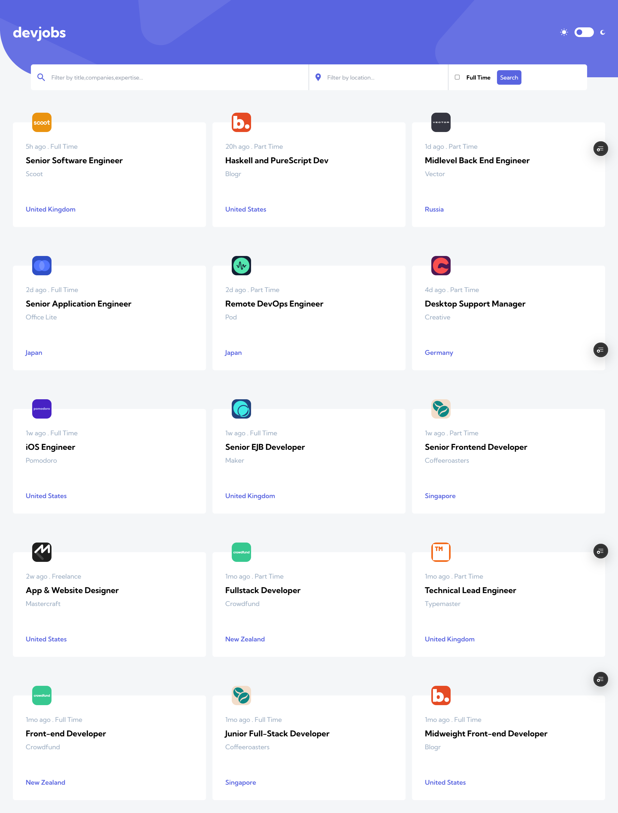
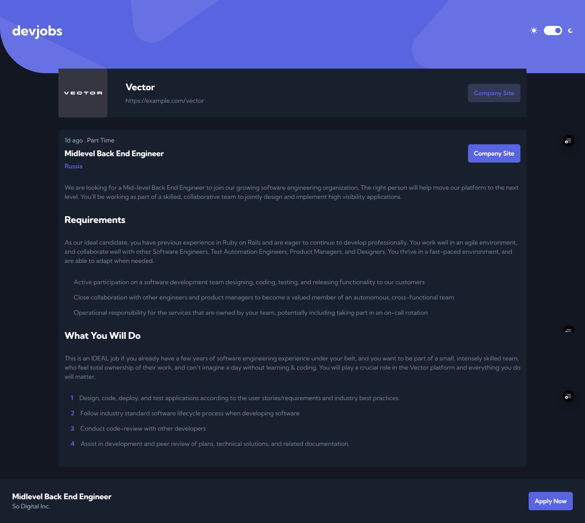

# Frontend Mentor - Contact form solution

This is a solution to the [Contact form challenge on Frontend Mentor](https://www.frontendmentor.io/challenges/contact-form--G-hYlqKJj). Frontend Mentor challenges help you improve your coding skills by building realistic projects.

## Table of contents

- [Overview](#overview)
  - [The challenge](#the-challenge)
  - [Screenshot](#screenshot)
  - [Links](#links)
- [My process](#my-process)
  - [Built with](#built-with)
  - [What I learned](#what-i-learned)
  - [Continued development](#continued-development)
  - [Useful resources](#useful-resources)
- [Author](#author)

## Overview

### The challenge

Users should be able to:

- Complete the form and see a success toast message upon successful submission
- Receive form validation messages if:
  - A required field has been missed
  - The email address is not formatted correctly
- Complete the form only using their keyboard
- Have inputs, error messages, and the success message announced on their screen reader
- View the optimal layout for the interface depending on their device's screen size
- See hover and focus states for all interactive elements on the page

### Screenshot

### Links

- Solution URL: [Github](https://github.com/donado10/devjobs-web-app)
- Live Site URL: [Live site](https://devjobs-web-app-ado.vercel.app/)

## My process

### Built with

- Semantic HTML5 markup
- Mobile-first workflow
- [NextJS](https://nextjs.org/) - JS library
- [Typescript](https://www.typescriptlang.org/) - JS with syntax for types.
- [Tailwind](https://tailwindcss.com/) - A utility-first CSS framework

**Note: These are just examples. Delete this note and replace the list above with your own choices**

### What I learned

How to use server actions

### Continued development

I want to use the custom component that I created related to the Radio Input for future projects

### Useful resources

## Author

- Frontend Mentor - [@donado10](https://www.frontendmentor.io/profile/donado10)
- Twitter - [@hey\_\_ado](https://x.com/Hey__Ado)
